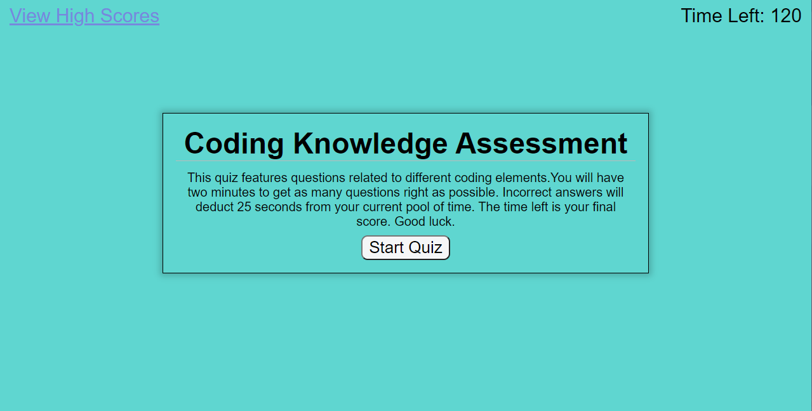

This project is a quiz that will test the user's knowledge regarding HTML and Javascript. The user will have a set period of time to complete the quiz. Incorrect answers will deduct a portion of time from the quiz. At the end of the quiz the user's score will be logged.

This project utilizes HTML, CSS and Javascript. 

The website required to view this project is located <a href="https://snowslurpie.github.io/quiz_challenge/" target="_blank"> here</a>

